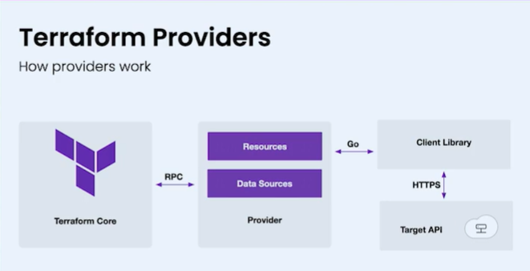

# Create Custom Terraform Provider

- ref: https://www.youtube.com/watch?v=16qs7LJSyps



```bash
# Rename root directory to terraform-provider-${YOUR_PROVIDER}

cd terraform-provider-terasky

go mod edit -module terraform-provider-terasky

go mod tidy
```

Change main.go import section:
```bash
import (
	"context"
	"flag"
	"log"

	"github.com/hashicorp/terraform-plugin-framework/providerserver"
	"github.com/terasky-cna/terraform-provider-terasky/internal/provider"
)
```